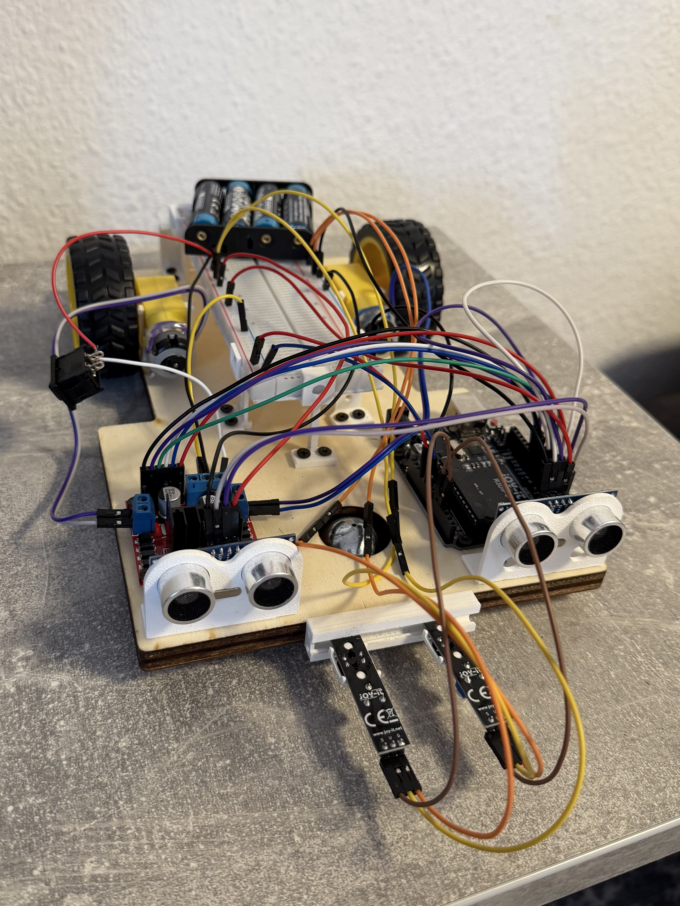

# Autonomous Vehicle System

Arduino-based autonomous vehicle capable of:
- obstacle detection and avoidance,
- ultrasonic sensing,
- IR line tracking,
- and autonomous movement using DC motors.

---

## Vehicle Preview

---

## Features

- Autonomous movement
- Ultrasonic obstacle detection
- Obstacle avoidance
- IR sensor integration
- Modular software architecture
- Tinkercad simulation support

---

## Hardware Used

- Arduino Uno
- L298N Motor Driver
- 2x TT Motors
- 2x Ultrasonic Sensors
- 2x IR Sensors
- Battery Pack
- Power Switch

---

## Software Structure

### Source Files
- `main.cpp` → Main autonomous vehicle logic
- `motors.cpp/.h` → Motor control subsystem
- `ultrasonic.cpp/.h` → Ultrasonic sensor subsystem
- `irsensors.cpp/.h` → IR sensor subsystem

### Additional Main Files
- `main2.cpp` → Alternative autonomous implementation
- `main3.cpp` → Ultrasonic testing/navigation

---

## Tinkercad

`tinker_code.cpp` is a combined single-file version of the project used for Tinkercad simulation.

Since Tinkercad does not support multiple header/source files, all subsystem implementations were merged into one file for easier testing and simulation.

---

## Included Diagrams

- Requirement Diagram
- BDD
- IBD
- Activity Diagram
- Package Diagram
- Use Case Diagram
- Sequence Diagram

---

## Repository Contents

- Source code
- Tinkercad simulation files
- System diagrams
- Vehicle assembly images/videos
- 3D printed parts

---

## Current Status

The project currently includes:
- autonomous movement,
- obstacle avoidance,
- modular subsystem integration,
- and first-version software implementation.

Some features, such as IR line tracking, are still being tested and refined.
